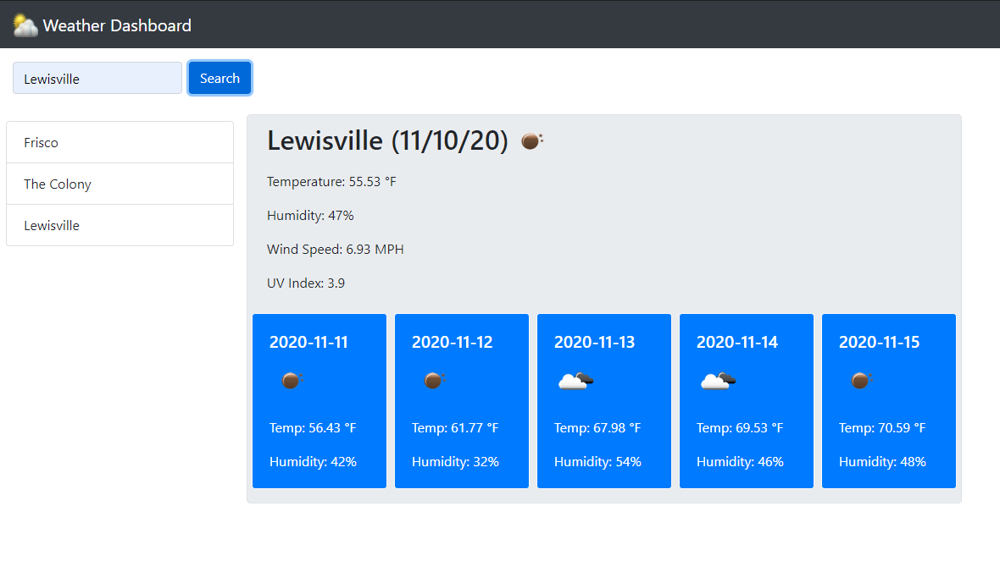
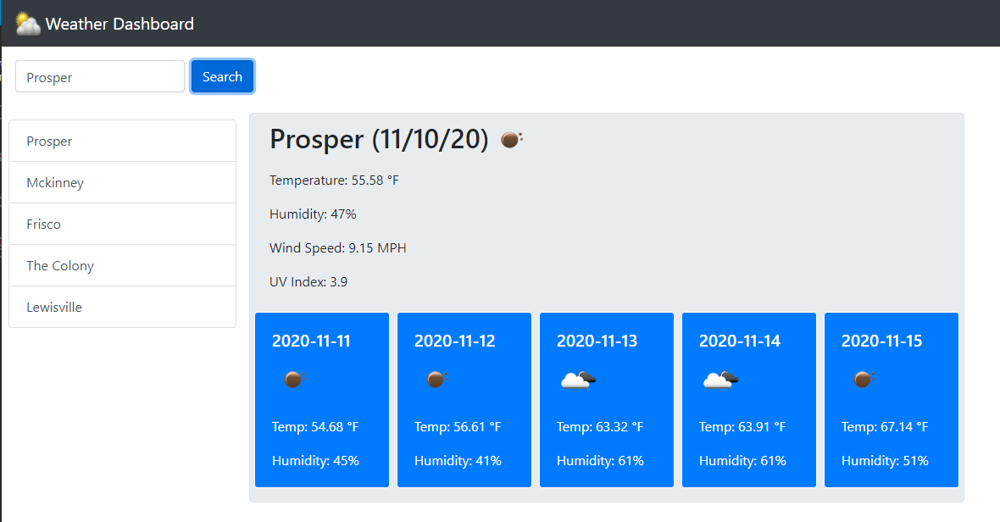

# 06 Server-Side APIs: Weather Dashboard

- Repository link: https://github.com/greysonkirk/WeatherApp
- Web App link:  https://greysonkirk.github.io/WeatherApp/

  - This web app uses three OpenWeather API's to retrieve data based on the city the user searched. 
  - The first API brings back current weather data and its displayed above the 5 day forecast. 
  - The second API brings back the UV Index for that city and its also placed above the 5 day forecast. 
  - The third API is the 5 day forecast for that city. 

  - The user types in a city they wish to see and then the api's are called and the data is displayed. 
  - The user's search history is stored locally and is displayed under the search bar. 
  - The user can click on any previously searched city and view that data again. 

